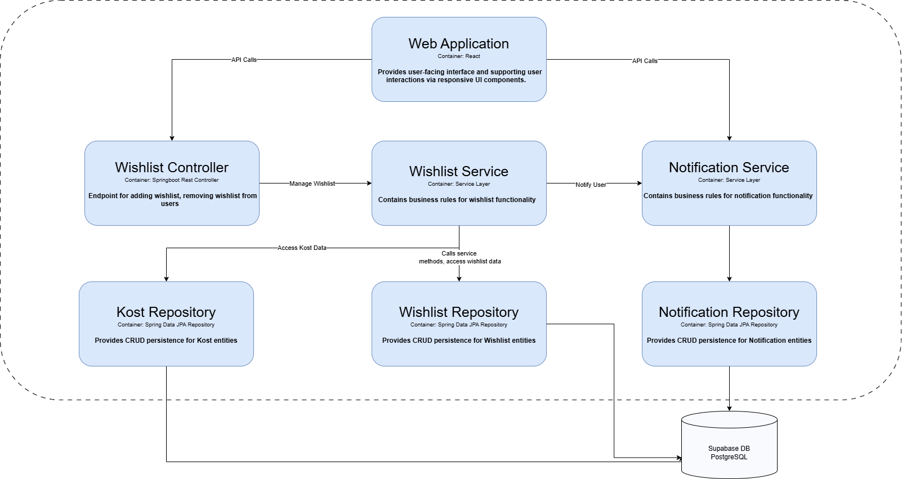

# Dokumentasi Diagram PapiKos

## Context Diagram

## Deployment Diagram

## Container Diagram

# Future Architecture

## Context Diagram

## Container Diagram

# Explanation of Risk Storming

Setelah melakukan diskusi yang cukup mendalam, kami menemukan beberapa celah risiko dalam aplikasi kami. Salah satu risiko yang sering muncul adalah penyimpanan data sensitif tanpa perlindungan yang memadai. Data seperti password, token akses, atau informasi pengguna rentan disalahgunakan jika tidak dienkripsi dengan benar. Selain itu, celah keamanan juga bisa muncul jika API tidak memiliki otentikasi dan otorisasi yang ketat. Untuk mengatasi hal ini, perlu diterapkan enkripsi yang kuat seperti AES atau RSA untuk data yang disimpan, serta hashing menggunakan bcrypt untuk password. API harus dilindungi dengan otentikasi berbasis token (seperti JWT), pembatasan akses berdasarkan peran (RBAC), dan rate limiting untuk mencegah penyalahgunaan.

Dari sisi performa, risiko muncul saat aplikasi harus menangani data dalam jumlah besar tetapi tidak didukung oleh query database yang efisien. Hal ini bisa menyebabkan keterlambatan dalam respon aplikasi dan menurunkan pengalaman pengguna secara keseluruhan. Solusinya adalah dengan mengoptimalkan query menggunakan indexing, menghindari operasi kompleks dalam satu query, serta menerapkan caching di layer aplikasi dengan Redis atau mekanisme serupa untuk mengurangi beban langsung pada database. Tidak lupa, kami memilih untuk menggunakan database system yang memadai yaitu PostgreSQL daripada menyimpan data dalam bentuk List, HashMap, atau struktur data lain yang berjalan diatas JVM. Hal ini dipilih, sebagai bentuk antisipasi memory leak, keamanan, dan availability dari data itu sendiri. 

Risiko skalabilitas juga patut diperhatikan, terutama jika aplikasi dirancang hanya untuk menangani beban rendah. Ketika jumlah pengguna meningkat, sistem bisa gagal merespons dengan cepat atau bahkan mengalami crash. Untuk menghindarinya, aplikasi perlu dirancang agar dapat diskalakan secara horizontal, misalnya dengan menggunakan container (Docker) dan layanan orkestrasi seperti Kubernetes. Selain itu, arsitektur microservices dapat diterapkan agar setiap bagian aplikasi dapat diskalakan secara independen sesuai kebutuhan. Pengguna arsitektur independen (microservices) juga membuat kami dapat mengimplementasikan paradigma asinkron, dimana frontend akan tetap berjalan dengan baik meskipun seluruh backend kami sedang memproses request yang lain.

Secara keseluruhan, mitigasi risiko teknis dalam aplikasi memerlukan kombinasi antara desain arsitektur yang tangguh, pengamanan data, dan optimalisasi performa. Langkah-langkah ini tidak hanya mencegah gangguan teknis di kemudian hari, tetapi juga memastikan aplikasi tetap andal, cepat, dan aman dalam skenario penggunaan maksimal.

# Individu
## 2306275935 - Alpha Sutha Media
### Component Diagram

### Code Diagram

## 2306275903 - Rayhan Syahdira Putra
### Wishlist Component Diagram

### Wishlist Code Diagram

## 2306241726 - Alwie Attar Elfandra
### Wishlist Component Diagram

### Wishlist Code Diagram

## 2306152166 - Brian Altan
### Payment Component Diagram

### Payment Code Diagram

## 2306152393 - Arzaka Raffan
### Kupon Component Diagram

### Kupon Code Diagram

